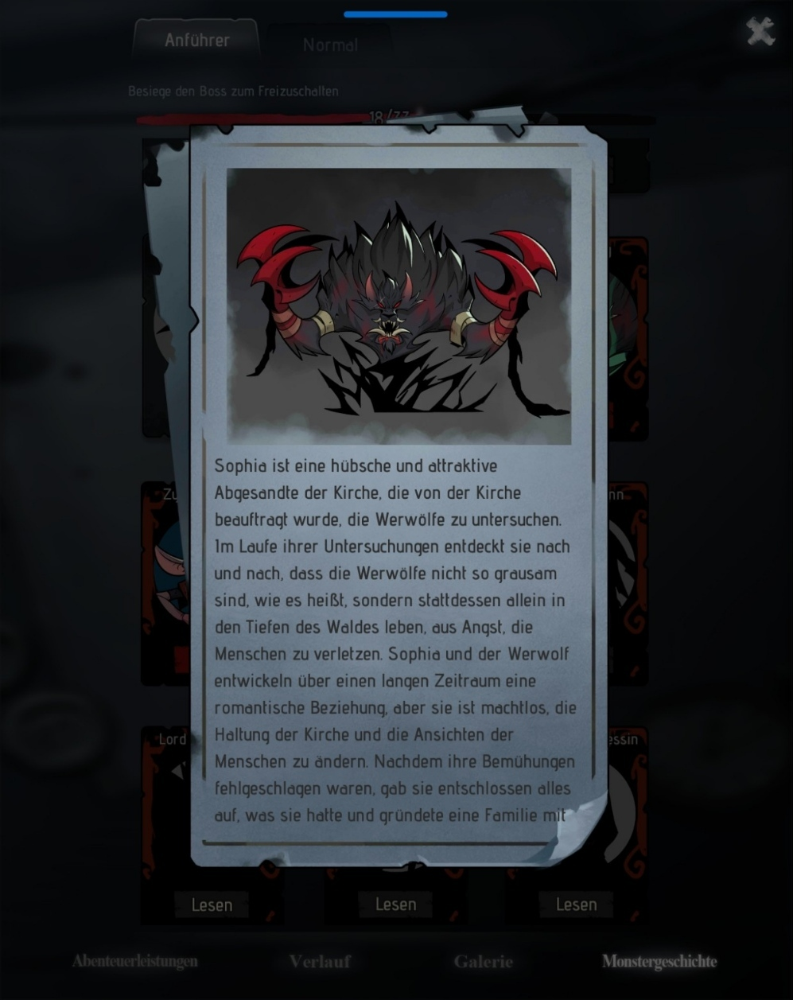

## 学习资源
* [Duden](https://www.duden.de)：杜登词典在线版。

## Volkabeln und Text
|Deutsch|?|Englisch|
|---|---|---|
|hübsch|adj|pretty|
|Abgesandte|m/f|envoy|
|Kirche|f|church|
|beauftragen|v|to hire|
|Werwolf|m|werewolf|
|entdecken|v|to discover|
