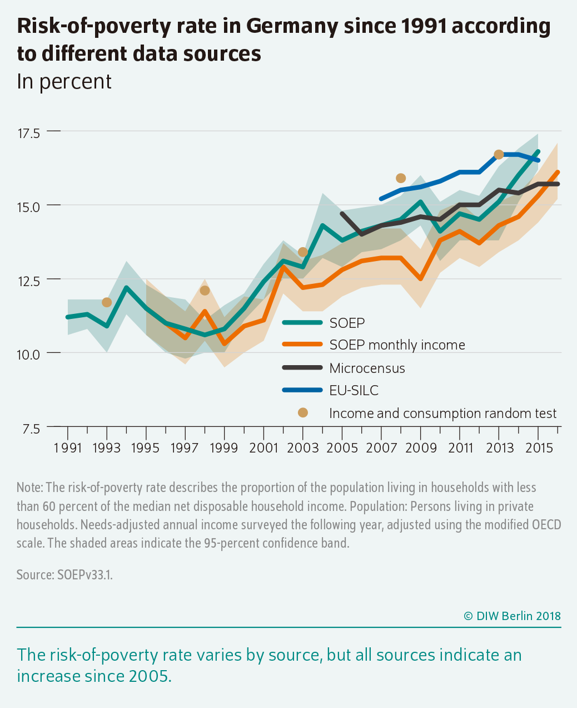

# Globe Poverty

This passage was written for my course assignment, which is about the basic situation and main causes of poverty in the world. But I think this topic is too general, so I chose Germany as the subject of my research.

## Wie wird absoluter Armut definiert?

In class, my teacher told us that the extreme poverty line is defined as having less than $1.25 a day to live on, but this data is long outdated.

> In May 2020, the International Comparison Program (ICP) released new purchasing power parities (PPPs) based on price data collected in 176 economies in 2017. Poverty estimates are often updated with new PPP data to reflect new information on price differences across countries. Related statistics such as gross domestic product (GDP) are similarly updated with new PPPs. When switching to a different base year (in this case, 2017), two revisions are made. First, the consumption aggregate of each household is converted into dollars of the new base year using the new price information. Second, the poverty line used to assess whether a household is poor is also updated to the new base year. [^1]

```mermaidjs
timeline
    title Poverty Line
    1985 : US\$1.00 (1985 PPP)
    1993 : US\$1.08 (1993 PPP)
    2005 : US\$1.25 (2005 PPP)
    2011 : US\$1.90 (2011 PPP)
    2017 : US\$2.15 (2017 PPP)
```

## Armutsgefährdungsquote: Different from China's Poverty Definition

In Germany, poverty development is often described by the so-called **at-risk-of-poverty rate**. This indicates the proportion of people at risk of poverty in a total group. The measurement of poverty risk is based on the relative definition of poverty. [^2]

The following are the statistics of at-risk-of-poverty rate in german from __Statista__ and __Eurostat__.

```ts
option = {
  title: {
    text: 'Armutsgefährdungsquote in Deutschland',
    left: 'center'
  },
  xAxis: {
    type: "category",
    data: ["2004", "2005", "2006", "2007", "2008", "2009", "2010", "2011", "2012", "2013", "2014", "2015", "2016", "2017", "2018", "2019", "2020", "2021", "2022"]
  },
  yAxis: {
    type: "value"
  },
  tooltip: {
    trigger: 'axis'
  },
  legend: {
    data: ['Statista', 'Eurostat'],
    top: 'bottom'
  },
  series: [{
    data: [null, 14.7, 14.0, 14.3, 14.4, 14.6, 14.5, 15.0, 15.0, 15.5, 15.4, 15.7, 15.7, 15.8, 15.5, 15.9, 16.2, 16.6],
    type: "line",
    name: "Statista"
  }, {
    data: [null, null, null, null, 15.2, null, null, 15.8, 16.1, 16.1, 16.7, 16.7, 16.5, 16.1, 16.0, 14.8, 16.1, 16.0],
    type: "line",
    name: "Eurostat"
  }]
};
```

DIW Berlin provides an image that contains the richest data. Details are not public.



## Mikrozensus: A Different Survey Method than in China

The term "microcensus" means "small population census". The microcensus is the largest annual household survey of official statistics in Germany. The survey has been conducted jointly by the Federal and State Statistical Offices since 1957. Around 810,000 people in approximately 370,000 private households and community accommodations are surveyed, representing about 1% of the population in Germany on their working and living conditions.

[mikrozensus_en.mp4](https://chat.cnection.cn/mikrozensus_en.mp4)

## Poverty in Rich: Situation of German Poverty

Although Germany is one of the richest countries in the world, signs of increasing poverty are becoming increasingly visible across the country. Homeless people sleeping rough, mothers forgoing meals in order to feed their children, and pensioners looking for discarded bottles to trade for the deposit.

参考资料待整理：

- Paritätische Wohlfahrtsverband: [Armut in Deutschland wächst | Hintergrund aktuell | bpb.de](https://www.bpb.de/kurz-knapp/hintergrund-aktuell/516505/armut-in-deutschland-waechst/)
- Deutsche Welle: [Germany: What poverty looks like in a rich country – DW – 10/10/2022](https://www.dw.com/en/germany-what-poverty-looks-like-in-a-rich-country/a-63393501)


### Vermögen sehr ungleich verteilt

(贫富差距极大)

### Erwerbslose, Alleinerziehende und Studierende besonders oft arm

(有些人群非常贫困)

### Frauen häufiger von Armut bedroht

(女性更容易贫困)

### Kritik an Maßnahmen

(对现有举措的批评)


[^1]: [Poverty and Shared Prosperity 2022 Report](https://openknowledge.worldbank.org/server/api/core/bitstreams/b96b361a-a806-5567-8e8a-b14392e11fa0/content)

[^2]: Translated from: [Armut in Deutschland wächst | Hintergrund aktuell | bpb.de](https://www.bpb.de/kurz-knapp/hintergrund-aktuell/516505/armut-in-deutschland-waechst/)