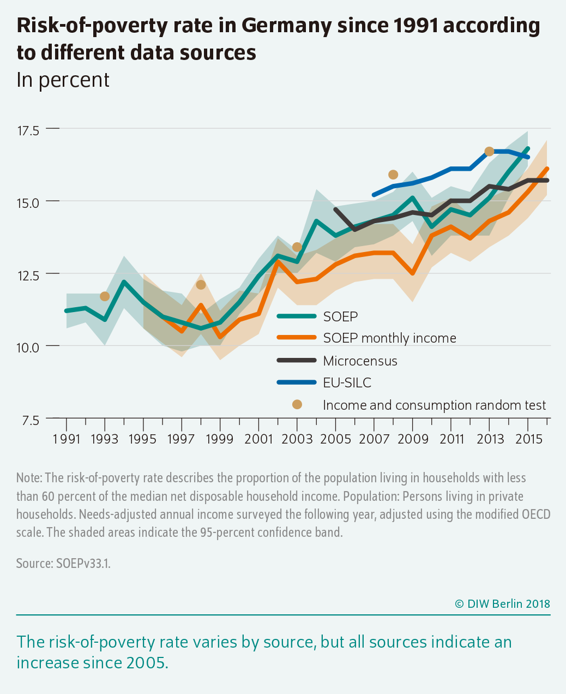
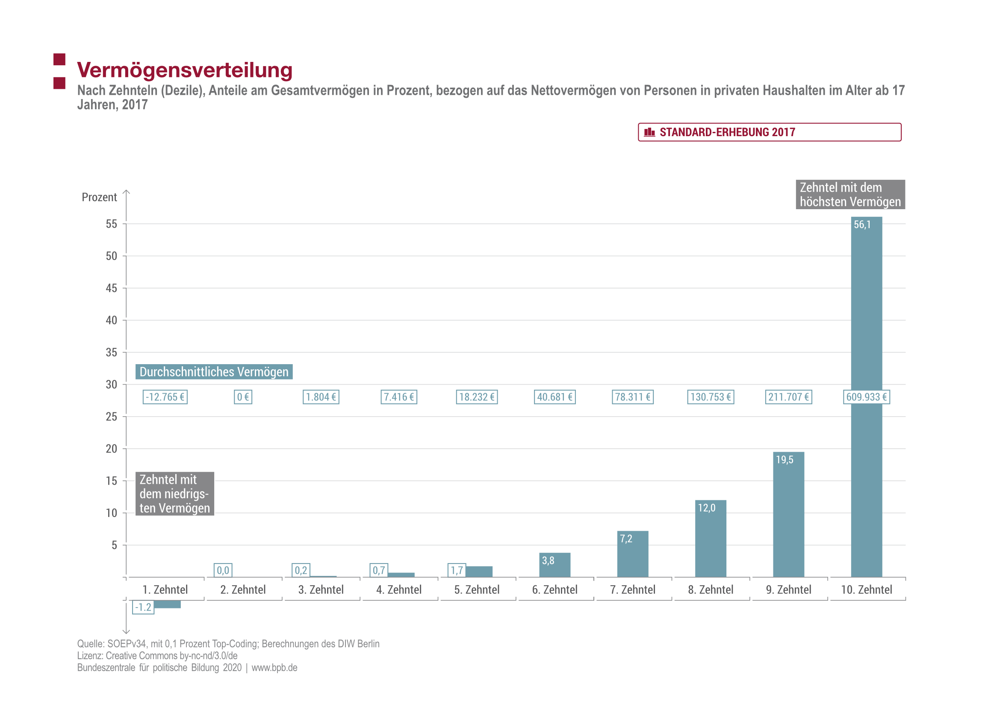
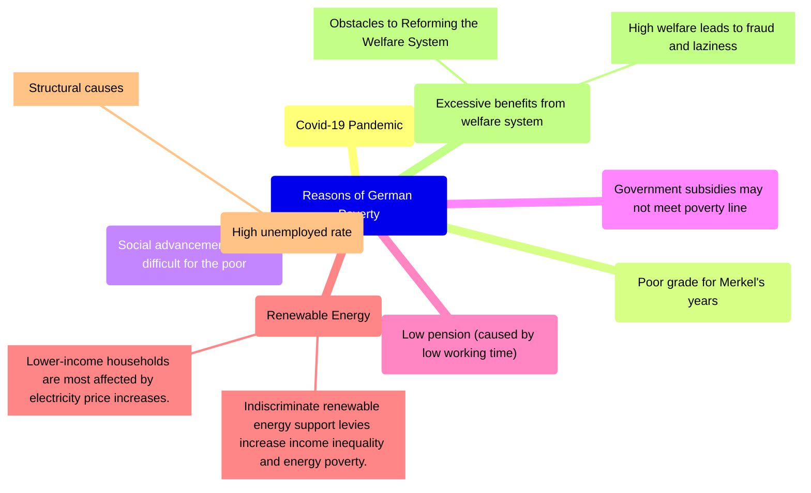

# Poverty in German

This passage was written for my course assignment, which is about the basic situation and main causes of poverty in the world. But I think this topic is too general, so I chose Germany as the subject of my research.

<!-- ## Wie wird absoluter Armut definiert?

In class, my teacher told us that the extreme poverty line is defined as having less than $1.25 a day to live on, but this data is long outdated.

> In May 2020, the International Comparison Program (ICP) released new purchasing power parities (PPPs) based on price data collected in 176 economies in 2017. Poverty estimates are often updated with new PPP data to reflect new information on price differences across countries. Related statistics such as gross domestic product (GDP) are similarly updated with new PPPs. When switching to a different base year (in this case, 2017), two revisions are made. First, the consumption aggregate of each household is converted into dollars of the new base year using the new price information. Second, the poverty line used to assess whether a household is poor is also updated to the new base year. ^[[Poverty and Shared Prosperity 2022 Report](https://openknowledge.worldbank.org/server/api/core/bitstreams/b96b361a-a806-5567-8e8a-b14392e11fa0/content)]

```mermaidjs
timeline
    title Poverty Line
    1985 : US\$1.00 (1985 PPP)
    1993 : US\$1.08 (1993 PPP)
    2005 : US\$1.25 (2005 PPP)
    2011 : US\$1.90 (2011 PPP)
    2017 : US\$2.15 (2017 PPP)
``` -->

## Armutsgefährdungsquote: Different from China's Poverty Definition

In Germany, poverty development is often described by the so-called **at-risk-of-poverty rate**. This indicates the proportion of people at risk of poverty in a total group. The measurement of poverty risk is based on the relative definition of poverty. [^Paritätische_Wohlfahrtsverband]

::: echarts

```js
option = {
  title: {
    text: "Armutsgefährdungsquote in Deutschland",
    left: "center",
  },
  xAxis: {
    type: "category",
    data: [
      "2004",
      "2005",
      "2006",
      "2007",
      "2008",
      "2009",
      "2010",
      "2011",
      "2012",
      "2013",
      "2014",
      "2015",
      "2016",
      "2017",
      "2018",
      "2019",
      "2020",
      "2021",
      "2022",
    ],
  },
  yAxis: {
    type: "value",
  },
  tooltip: {
    trigger: "axis",
  },
  legend: {
    data: ["Statista", "Eurostat"],
    top: "bottom",
  },
  series: [
    {
      data: [
        null,
        14.7,
        14.0,
        14.3,
        14.4,
        14.6,
        14.5,
        15.0,
        15.0,
        15.5,
        15.4,
        15.7,
        15.7,
        15.8,
        15.5,
        15.9,
        16.2,
        16.6,
      ],
      type: "line",
      name: "Statista",
    },
    {
      data: [
        null,
        null,
        null,
        null,
        15.2,
        null,
        null,
        15.8,
        16.1,
        16.1,
        16.7,
        16.7,
        16.5,
        16.1,
        16.0,
        14.8,
        16.1,
        16.0,
      ],
      type: "line",
      name: "Eurostat",
    },
  ],
};
```

:::

DIW Berlin provides an image that contains the richest data. Details are not public.



## Mikrozensus: A Different Survey Method than in China

The term "microcensus" means "small population census". The microcensus is the largest annual household survey of official statistics in Germany. The survey has been conducted jointly by the Federal and State Statistical Offices since 1957. Around 810,000 people in approximately 370,000 private households and community accommodations are surveyed, representing about 1% of the population in Germany on their working and living conditions.

<video src="https://www.destatis.de/static/EN/videos/StatistischesBundesamt_Mikrozensus_EN.mp4" controls width="100%"></video>

## Neue Armut: Causes & Effects of German Poverty

Although Germany is one of the richest countries in the world, signs of increasing poverty are becoming increasingly visible across the country. Homeless people sleeping rough, mothers forgoing meals in order to feed their children, and pensioners looking for discarded bottles to trade for the deposit. ^[[Germany: What poverty looks like in a rich country – DW – 10/10/2022](https://www.dw.com/en/germany-what-poverty-looks-like-in-a-rich-country/a-63393501)]

### 特点

- Wealth very unevenly distributed. [^Paritätische_Wohlfahrtsverband]
- Unemployed, single parents, and students particularly often poor. [^Paritätische_Wohlfahrtsverband]
- Women more frequently threatened by poverty. [^Paritätische_Wohlfahrtsverband]



### 原因

- Covid-19 Pandemic [^DW]
- Poor grade for Merkel's years [^DW]
- Social advancement is very difficult for the poor [^DW]
- Government subsidies may not meet poverty line [^Neue_Armut]
- Low pension (caused by low working time) [^Neue_Armut]
- Renewable Energy [^RES]
  - Indiscriminate renewable energy support levies increase income inequality and energy poverty. [^RES]
  - Lower-income households are most affected by electricity price increases. [^RES]
- High unemployed rate [^RR]
  - **Structural causes** ([table 1](./p3.jpg)), i.e., that it is related to excessive real wage costs to firms, lack of
    wage differentiation, rising mismatch problems etc. [^RR]
    - Wages, which are inappropriate from the perspective of attaining full employment, in all its different facets — excessive real wage cost pressure on firms, wage rigidities of all kinds, lack of wage differentiation, excessive reservation wages etc. — lead to rising structural unemployment. [^RR]
- Excessive benefits from welfare system [^JZX]
  - **High welfare leads to fraud and laziness**: High welfare also induces some social problems, such as reducing people's enthusiasm for labor, not only raising a lot of "lazy", but also a lot of fraud activities. There was a freelance writer in an upmarket area with a villa with a garden who posed as an unemployed renter and claimed a €9,000 allowance. It is Germany's generous approach to welfare subsidies that provides a breeding ground for fraud. [^JZX]
  - **Obstacles to Reforming the Welfare System**: The reform of the welfare system has many difficulties and great obstacles. Especially, the deep-rooted welfare concept of the German people is unshakable. If not careful, it will stimulate and offend the voters and lead to the abyss of "whoever reforms, whoever steps down", resulting in the reform of the welfare system being unable to be thoroughly implemented. The welfare trap is thus holding back Germany's economic development. [^JZX]

:::tip I guess Ms. He would like this



:::

[^Paritätische_Wohlfahrtsverband]: [Armut in Deutschland wächst | Hintergrund aktuell | bpb.de](https://www.bpb.de/kurz-knapp/hintergrund-aktuell/516505/armut-in-deutschland-waechst/)
[^Neue_Armut]: 潘亚玲,杨阳.德国“新贫困”问题研究[J].当代世界社会主义问题,2019(03):148-157.DOI:10.16012/j.cnki.88375471.2019.03.018.
[^DW]: [Wachsende Kluft zwischen Arm und Reich in Deutschland | Deutschland | DW | 13.05.2021](https://www.dw.com/de/wachsende-kluft-zwischen-arm-und-reich-in-deutschland/a-57506792)
[^RR]: Norbert Berthold & Rainer Fehn, 2003. "Unemployment in Germany: Reasons and Remedies," CESifo Working Paper Series 871, CESifo.
[^JZX]: 魏磊.德国福利制度改革的困局与怪圈[J].领导之友,2007(06):55-56.DOI:10.16321/j.cnki.ldzy.2007.06.015.
[^RES]: Priesmann Jan,Spiegelburg Saskia,Madlener Reinhard,Praktiknjo Aaron. Does renewable electricity hurt the poor? Exploring levy programs to reduce income inequality and energy poverty across German households[J]. Energy Research & Social Science,2022,93.
