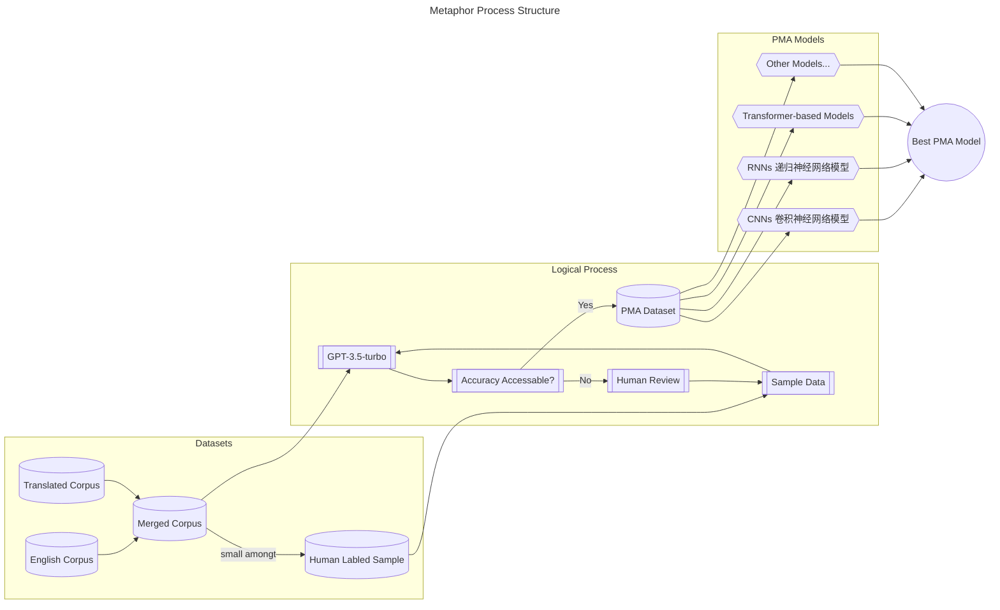

# Automated Analysis of Political Metaphors Based on Large Language Models: A Case Study of Trump’s Inaugural Speech

:::tip Abstract
Political metaphors are widely used to shape public opinion and influence decision-making. However, traditional methods of political metaphor analysis (PMA) are often time-consuming, subjective and limited in scope. In this paper, we introduce a novel approach to PMA based on generative pre-trained transformers (GPT), a recent trend in natural language processing. We use GPT-3.5, a large-scale language model released by OpenAI, to analyse a corpus of political passages and generate a new dataset containing text and metaphor predictions. We then use this dataset to train our own metaphor model based on <根据实验结果选择最合适的模型>, which can identify and classify metaphors in political discourse. We test our metaphor model on the case of Trump's inaugural speech and achieve an accuracy of about <这篇论文是否存在取决于准确率的高低>, which indicates that our model can be used to analyse political metaphors effectively and efficiently.
:::

## 1 Introduction

^[Dementieva D, Trifinov I, Likhachev A, et al. Detecting Text Formality: A Study of Text Classification Approaches[EB/OL]. arXiv:2204.08975[cs.CL], 2022.]
^[Wu C, Yin S, Qi W, et al. Visual ChatGPT: Talking, Drawing and Editing with Visual Foundation Models[EB/OL]. arXiv:2303.04671[cs.CV], 2023.]
^[Shen Y, Song K, Tan X, et al. HuggingGPT: Solving AI Tasks with ChatGPT and its Friends in HuggingFace[EB/OL]. arXiv:2303.17580[cs.CL], 2023.]

## 2 Related Works

### 2.1 Large Language Models

^[Brown T B, Mann B, Ryder N, et al. Language Models are Few-Shot Learners[C]. Conference on Neural Information Processing Systems (NeurIPS), 2020.]
^[Ouyang L, Wu J, Jiang X, et al. Training language models to follow instructions with human feedback[EB/OL]. 2022.]
^[Chowdhery A, Narang S, Devlin J, et al. PaLM: Scaling Language Modeling with Pathways[EB/OL]. arXiv:2204.02311[cs.CL], 2022.]
^[Zhang S, Roller S, Goyal N, et al. Opt: Open Pre-trained Transformer Language Models[EB/OL]. ArXiv, abs/2205.01068, 2022.]
^[Zeng A, Liu X, Du Z, et al. Glm-130b: An Open Bilingual Pre-trained Model[C]. ICLR 2023 poster, 2023.]
^[Touvron H, Lavril T, Izacard G, et al. Llama: Open and Efficient Foundation Language Models[EB/OL]. ArXiv, abs/2302.13971, 2023.]

### 2.2 Political Metaphor Analysis

^[Musolff A. Political Metaphor Analysis: Discourse and Scenarios[M]. London: Bloomsbury Academic, 2016.]

### 2.3 Advances in LLM Capabilities

## 3 Datasets

### 3.1 Political Discourse in English

^[[erikgahner/PolData: A dataset with political datasets](https://github.com/erikgahner/PolData)]

### 3.2 Official Translated Political Discourse

^[[《习近平谈治国理政》多语数据库综合平台](http://imate.cascorpus.com)]
^[[新时代中国特色话语大数据平台 Portal for Chinese Key Discourses in the New Era](http://49.232.145.25/data)]

## 4 PMA Models

### 4.1 GPT-3.5 Based Machine Labeling

### 4.2 Model Selection

## 5 Experiments

### 5.1 Setting

### 5.2 Case Study

^[[The Inaugural Address – The White House](https://trumpwhitehouse.archives.gov/briefings-statements/the-inaugural-address)]
^[武建国,龚纯,宋玥.政治话语的批评隐喻分析——以特朗普演讲为例[J].外国语(上海外国语大学学报),2020,43(03):80-88.]
^[孙毅,李全.政治隐喻与隐喻政治——基于特朗普总统就职演讲的隐喻图景分析[J].山东外语教学,2019,40(05):35-47.DOI:10.16482/j.sdwy37-1026.2019-05-004.]

## 5 Discussions

## 6 Conclusion
