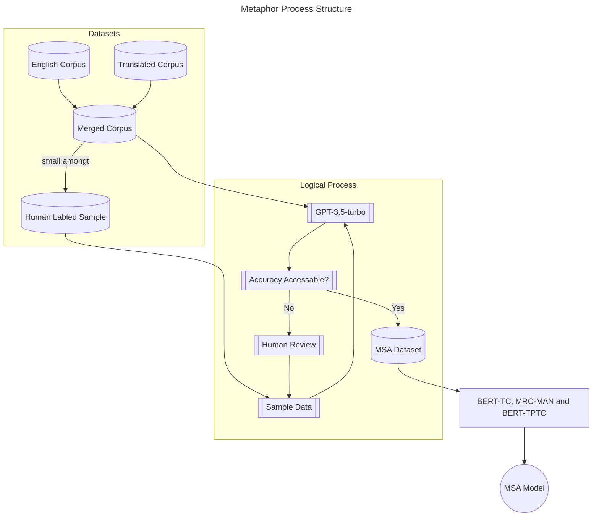
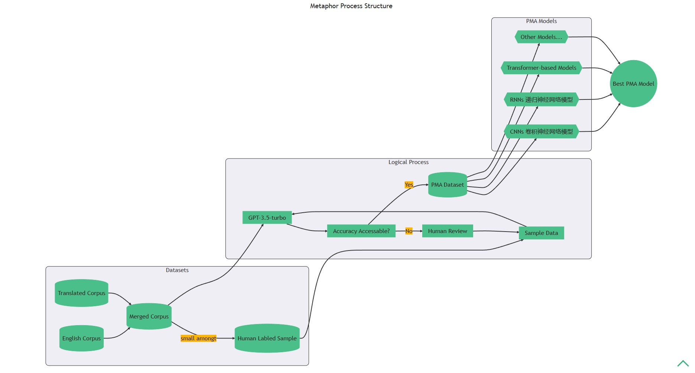

# 基于深度学习的自动化政治隐喻分析研究：以特朗普就职演讲为例

:::tip Abstract
Political metaphors are widely used to shape public opinion and influence decision-making. However, traditional methods of political Metaphor Scenario analysis (MSA) are often time-consuming, subjective and limited in scope. In this paper, we introduce a novel approach to MSA based on generative pre-trained transformers (GPT), a recent trend in natural language processing. We use GPT-3.5, a large-scale language model released by OpenAI, to analyse a corpus of political passages and generate a new dataset containing text and metaphor predictions. We then use this dataset to train our own metaphor model based on <根据实验结果选择最合适的模型>, which can identify and classify metaphors in political discourse. We test our metaphor model on the case of Trump's inaugural speech and achieve an accuracy of about <这篇论文是否存在取决于准确率的高低>, which indicates that our model can be used to analyse political metaphors effectively and efficiently.
:::

## 目录

[[toc]]

## 1 Introduction

### 1.1 课题研究背景

One day, my instructor assigned us the task of composing an outline regarding a specific study on Trump’s Inaugural Address. While researching this topic, I discovered an intriguing approach to analysis known as Metaphor Scenario analysis (MSA). Based on the essays I read, it appears that this type of study is largely constrained by traditional methods of analysis, which involve detailed human examination of political texts. As a result, researchers are often limited to analyzing only a few texts, or even just one, for the entirety of their study. This precludes the possibility of drawing broader conclusions about specific political figures or other areas of inquiry.

有一天，我的老师要求我们写一篇关于特朗普就职演说的特定研究的提纲。在研究这个主题时，我发现了一种名为隐喻图景分析（MSA）的有趣分析方法。根据我阅读的几篇论文，这种研究类型很大程度上受到传统分析方法的限制，这些方法涉及对政治文本的详细人工检查。因此，研究人员通常只能分析几篇甚至只有一篇文本来进行整个研究。这排除了关于特定政治人物或其他研究领域得出更广泛结论的可能性。

### 1.2 研究目的和意义

In an effort to expedite research in the field of MSA and complete our assigned coursework, we have developed a deep learning training system with the aim of automating MSA. Should the resulting model achieve an F1 score exceeding 0.99, it will be deemed suitable for utilization in large sample analysis for real research purposes.

为了加快 MSA 领域的研究并完成我们指定的课程作业，我们开发了一个深度学习训练系统，目的是使 MSA 自动化。如果产生的模型达到了超过 0.95 的 F1 分数，它将被认为适合用于实际研究目的的大样本分析。

## 2 Related Works

### 2.1 Large Language Models

While GPT-4 may be the most suitable Large Language Model (LLM) for this task, it is not open source and therefore cannot be utilized in this research. Additionally, our instructor has expressed a preference against using GPT-4 for coursework. Fortunately, many foundation models for GPT-4 are open source and their reliability has been demonstrated by the success of the GPT series. In this study, we have elected to use BERT-TC (BERT-based Token Classification) as our tokenizer and MRC-MAN (Machine Reading Comprehension with Max Argument Number) and BERT-TPTC (BERT-based Two-Phased Token Classification) to identify tokens (words or phrases) of value in MSA research.

虽然 GPT-4 可能是最适合这项任务的大型语言模型（LLM），但它不是开源的，因此不能在本研究中加以利用。此外，我们的老师也表示不愿意将 GPT-4 用于课程作业。幸运的是，GPT-4 的许多基础模型都是开源的，其可靠性已经被 GPT 系列的成功所证明。在这项研究中，我们选择使用 BERT-TC 作为我们的 tokeniser，并使用 MRC-MAN 和 BERT-TPTC 来识别具有 MSA 研究价值的 token（单词或短语）。

### 2.2 Metaphor Scenario analysis

MSA is a prime example of the eclectic nature of academic research on metaphor in political discourse. Synthesising the main tenets of Conceptual Metaphor Theory (CMT), Critical Discourse Analysis (CDA) and Critical Metaphor Analysis (CMA) — which together provide the theoretical framework for investigating the multiple functions of political metaphor and metonymy — Musolff in his book presents a new methodological tool for metaphor research in discourse: the notion of metaphor scenarios, discourse-based conceptual structures realised in recurring narrative, argumentative and evaluative patterns that can be veri tied against synchronic or diachronic corpus data in order to yield insights into metaphor use, variation, interpretation and socio-historical situatedness.^[Musolff A. Political Metaphor Analysis: Discourse and Scenarios[M]. London: Bloomsbury Academic, 2016.]^[Arcimavičienė, L. (2017). A. Musolff, Political Metaphor Analysis: Discourse and scenarios. London: Bloomsbury Academic. Language and Cognition, 9(2), 371-377.]

政治隐喻分析是关于政治话语中隐喻的学术研究~~折衷性质~~兼收并蓄的一个典型例子。综合概念隐喻理论（CMT）、批评话语分析（CDA）和批评隐喻分析（CMA）的主要原则--它们共同为研究政治隐喻和隐喻的多种功能提供了理论框架——Musolff 在他的书中提出了一种用于话语中隐喻研究的新方法学工具：隐喻情景的概念，即以话语为基础的概念结构，在反复出现的叙述、论证和评价模式中得到实现，可以与同步或异步语料库数据进行对比，以产生对隐喻使用、变化、解释和社会历史状况的洞察力。

### 2.3 Advances in LLM Capabilities

介绍一下 LLM 的优势。^[Brown T B, Mann B, Ryder N, et al. Language Models are Few-Shot Learners[C]. Conference on Neural Information Processing Systems (NeurIPS), 2020.]^[Shen Y, Song K, Tan X, et al. HuggingGPT: Solving AI Tasks with ChatGPT and its Friends in HuggingFace[EB/OL]. arXiv:2303.17580[cs.CL], 2023.]

## 3 Datasets

### 3.1 Existing Papers

Although MSA is a relatively new theory, it has already been applied in numerous research papers. Some of these paper's subjects are written in English, such as a paper analyzing Brexit^[孙毅,熊佳腾.英国脱欧话语的批评隐喻分析[J].解放军外国语学院学报,2022,45(02):1-9+137+160.], and can be directly included in our dataset. Others are written in Chinese but have official English translations, such as a paper analyzing XI JINGPING THE GOVERNANCE OF CHINA^[王卫侠.《习近平谈治国理政》(第三卷)中的隐喻图景阐释——以旅程隐喻为例[J].宜春学院学报,2022,44(11):94-99.], and can be included in our dataset after simple processing.

虽然 MSA 是一个相对较新的理论，但它已经被应用于许多研究论文中。其中一些论文的研究对象是用英文写的，比如一篇分析英国脱欧的论文，可以直接包含在我们的数据集中。还有一些是用中文写的，但有正式的英文翻译，比如一篇分析《习近平谈治国理政》的论文，经过简单的处理后，也可以纳入我们的数据集。

### 3.2 Labeling

Upon conducting a preliminary assessment, it was determined that the data available from the papers was inadequate to support the training of our language model. As such, we will gather a comprehensive corpus of relevant texts ^[[《习近平谈治国理政》多语数据库综合平台](http://imate.cascorpus.com)]^[[新时代中国特色话语大数据平台 Portal for Chinese Key Discourses in the New Era](http://49.232.145.25/data)]^[[erikgahner/PolData: A dataset with political datasets](https://github.com/erikgahner/PolData)] for manual or machine labeling. It is anticipated that a minimum of 1GB of text data will be obtained for training purposes, meeting the standard criteria for a "small" language model.

在进行初步评估后，我们确定，从论文中获得的数据不足以支持我们的语言模型的训练。因此，我们将收集一个全面的相关文本语料库，用于人工或机器标记。预计将获得至少 1GB 的文本数据用于训练，以满足“小型”语言模型的标准。

如果上面的内容无法正常显示，下面是替代的图片：

## 4 MSA Model

### 4.1 隐喻事件处理的定义

### 4.2 隐喻事件提取的方法概述

### 4.3 基于 token 分类的隐喻类型识别方法

### 4.4 基于 MRC 框架和 token 分类的隐喻元素提取方法

### 4.5 基于规则的隐喻分离方法

## 5 Experiments

### 5.1 Setting

### 5.2 隐喻提取效果展示

### 5.3 Case Study

以特朗普就职演讲为例，尝试使用 MSA 模型进行快速政治隐喻分析。^[[The Inaugural Address – The White House](https://trumpwhitehouse.archives.gov/briefings-statements/the-inaugural-address)]^[武建国,龚纯,宋玥.政治话语的批评隐喻分析——以特朗普演讲为例[J].外国语(上海外国语大学学报),2020,43(03):80-88.]^[孙毅,李全.政治隐喻与隐喻政治——基于特朗普总统就职演讲的隐喻图景分析[J].山东外语教学,2019,40(05):35-47.DOI:10.16482/j.sdwy37-1026.2019-05-004.]

## 5 Discussions

## 6 Conclusion

## 7 Acknowledgment

这些参考资料不知道放哪里合适，就写这里吧。^[Dementieva D, Trifinov I, Likhachev A, et al. Detecting Text Formality: A Study of Text Classification Approaches[EB/OL]. arXiv:2204.08975[cs.CL], 2022.]^[Wu C, Yin S, Qi W, et al. Visual ChatGPT: Talking, Drawing and Editing with Visual Foundation Models[EB/OL]. arXiv:2303.04671[cs.CV], 2023.]^[秦琨. 基于深度学习的简历事件提取研究[D].华中科技大学,2021.DOI:10.27157/d.cnki.ghzku.2021.005568.]