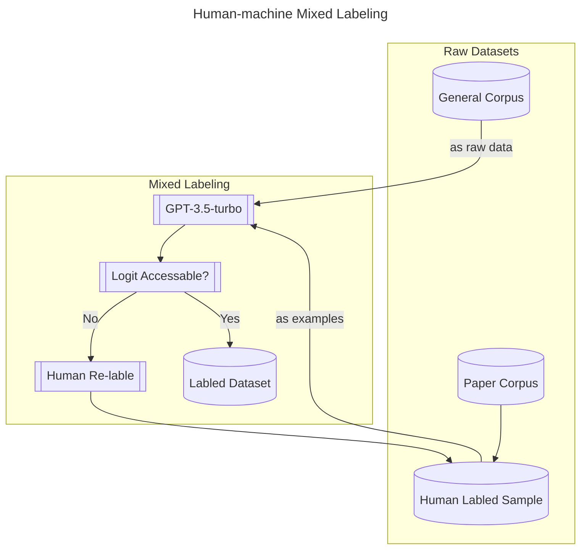

# 基于自然语言处理的隐喻类型识别

<!-- :::tip Abstract
Political metaphors are widely used to shape public opinion and influence decision-making. However, traditional methods of political Metaphor Scenario analysis (MSA) are often time-consuming, subjective and limited in scope. In this paper, we introduce a novel approach to MSA based on generative pre-trained transformers (GPT), a recent trend in natural language processing. We use GPT-3.5, a large-scale language model released by OpenAI, to analyse a corpus of political passages and generate a new dataset containing text and metaphor predictions. We then use this dataset to train our own metaphor model based on <根据实验结果选择最合适的模型>, which can identify and classify metaphors in political discourse. We test our metaphor model on the case of Trump's inaugural speech and achieve an accuracy of about <这篇论文是否存在取决于准确率的高低>, which indicates that our model can be used to analyse political metaphors effectively and efficiently.
::: -->

## 1 绪论

### 1.1 课题研究背景

#### 1.1.1 隐喻分析在相关领域的作用

#### 1.1.2 传统隐喻分析的局限性（耗时长、样本小）

### 1.2 课题研究意义

#### 1.2.1 构建了规模较大、质量较高的隐喻语料库

#### 1.2.2 通过NPL实现隐喻的自动识别

## 2 相关研究

### 2.1 传统人工和语料库的隐喻识别^[纪玉华,陈燕.批评话语分析的新方法：批评隐喻分析[J].厦门大学学报(哲学社会科学版),2007,No.184(06):42-48.]

### 2.2 基于神经网络算法的隐喻识别^[Chen X, Hai Z, Wang S, et al. Metaphor identification: A contextual inconsistency based neural sequence labeling approach[J]. Neurocomputing, 2021, 428: 268-279.]

### 2.3 大语言模型的应用^[OpenAI. GPT-4 Technical Report[R]. arXiv:2303.08774 [cs.CL], 2023.]

## 3 语料库的构建

### 3.1 现有隐喻分析类论文

#### 3.1.1 分析对象为英语的论文

#### 3.1.2 分析对象有官方英语翻译的论文

### 3.2 人工和机器标注^[Wang S H, Liu Y, Xu Y C, et al. Want To Reduce Labeling Cost? GPT-3 Can Help[EB/OL]. arXiv:2108.13487[cs.CL], 2021.]

#### 3.2.1 语料的收集和清洗/语料库的选择

#### 3.2.2 Active Labeling（论文中提到的人工和机器混合标注方法，直觉上好像不比我设计的方法更精确，但是我没有实验数据证明）

## 4 隐喻类型识别模型的训练

### 4.1 隐喻事件处理的定义（未读相关文献）

### 4.2 介绍两种向量生成策略（avg和tfidf）与两种聚类方法（KNN和SVM）（未读相关文献）

### 4.3 对向量生成策略和聚类方法排列组合得到四种训练方式并对比训练结果优劣

## 5 实验与测试

### 5.1 实验/测试环境

### 5.2 隐喻类型识别效果展示

### 5.3 个案研究

#### 5.3.1 尝试对特朗普就职演讲进行快速隐喻分析^[[The Inaugural Address – The White House](https://trumpwhitehouse.archives.gov/briefings-statements/the-inaugural-address)]^[武建国,龚纯,宋玥.政治话语的批评隐喻分析——以特朗普演讲为例[J].外国语(上海外国语大学学报),2020,43(03):80-88.]^[孙毅,李全.政治隐喻与隐喻政治——基于特朗普总统就职演讲的隐喻图景分析[J].山东外语教学,2019,40(05):35-47.DOI:10.16482/j.sdwy37-1026.2019-05-004.]

#### 5.3.2 尝试对特朗普任职期间的所有演讲进行历时性隐喻分析

## 5 总结与展望

## 6 致谢^[张辰麟. 基于自然语言处理技术的汉语委婉语资源库构建与应用[D].江西师范大学,2021.DOI:10.27178/d.cnki.gjxsu.2021.000497.]

