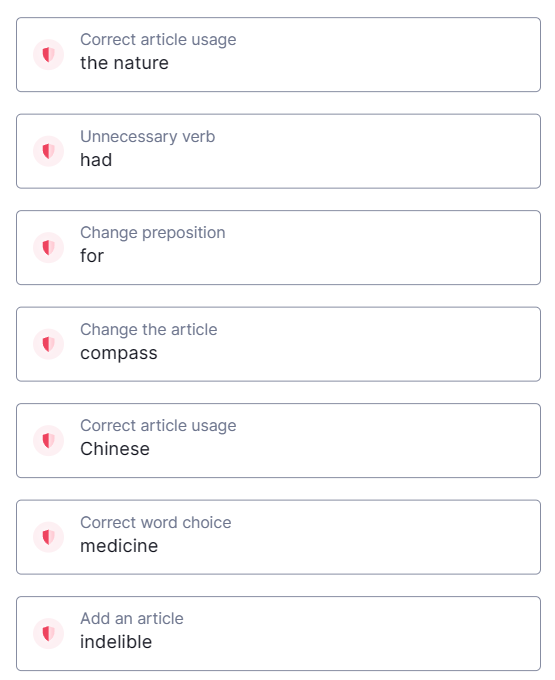

## Consistency

This section undertakes an analysis of translation errors found within the science museum, identifying inconsistencies and proposing strategies for improvement.

An instance of translation inconsistency arises from the use of varied terms denoting the same concept or object. For instance, "云锦" refers to a type of silk fabric originating in Nanjing, China, renowned for its intricate patterns and colors. However, within the museum, this term is inconsistently translated as "Brocade," "Ryun Jin Brocade," and "Yun Jin brocade," potentially confusing visitors or leading them to perceive differences where none exist. A viable solution entails adopting a standardized term such as "Nanjing Yunjin Brocade" used in UNESCO's Intangible Cultural Heritage^[https://ich.unesco.org/en/RL/craftsmanship-of-nanjing-yunjin-brocade-00200], accompanied by explanatory notes or captions elucidating its significance and origins.

Furthermore, another notable example of translation inconsistency manifests in the amalgamation of British English and American English spellings and expressions. For instance, while words such as "color" and "enameling" adhere to American English conventions, the syntactical structure follows British English norms, lacking the conjunction "and" after the final comma in parallel structures of sentences. Although such inconsistencies may not necessarily engender confusion or misinterpretation, they convey an aura of unprofessionalism, undermining the museum's credibility and commitment to precise scientific communication.

In conclusion, enhancing the consistency of translations within the science museum necessitates the adoption of standardized terms and expressions while eschewing the amalgamation of disparate linguistic styles or spellings. By doing so, visitors can accurately comprehend the provided information, thereby fostering a more enriching museum experience.

## Grammar and Typo

