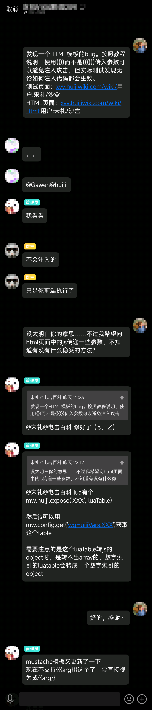

# 灰机wiki的HTML模板安全问题

因为最近想要向js代码中传递一些参数，所以稍微多考虑了一下安全性问题，专门测试了一下参数传递中可能出现的问题。

:::: code-group
::: code-group-item 普通WIKI页面
```wiki
{{#html:Html:用户:宋礼/沙盒
| {
"漏洞测试1":"\"><script>alert('你被攻击了1');</script><\/div><div id=\"",
"漏洞测试2":"\"><script>alert('你被攻击了2');</script><\/div><div id=\"",
"漏洞测试3":"${['这是用','JS代码','连在一起的句子1'].join('……')}",
"漏洞测试4":"${['这是用','JS代码','连在一起的句子2'].join('……')}"
} }}
```
:::
::: code-group-item HTML页面
```html
<div id="data" style="display:none" bug-test1="{{{漏洞测试1}}}" bug-test2="{{漏洞测试2}}"></div>
<script>
    console.log(`{{{漏洞测试3}}}`);
    console.log(`{{漏洞测试4}}`);
</script>
```
:::
::::

按照灰机的文档（或者说按照Moustache的官方文档），使用`{{参数}}`而不是`{{{参数}}}`可以避免可以避免注入攻击，但实际测试发现无论如何注入代码都会生效——网页弹出了两次提示，控制台两次显示了js处理过后的文字。

随后我在灰机wiki的QQ群内反馈，问题很快得到修复。



也就是说在以前，只要使用了`{{{参数}}}`或`{{参数}}`，所有可以编辑普通页面的用户就都拥有了开发者权限，也就是直接写入HTML的权限。

但是很快我们就发现，灰机的这个bug自古就有，因为很多灰机早期就出现的基础模板都“利用”了这个bug，我自己写的一些模板也存在问题。


当然了，我们也不是故意利用漏洞的，写代码嘛，能用就行，谁知道代码运行的时候发生了什么呢？况且其中包括我在内的一些模板用的是`{{参数}}`，按照灰机的文档来说这就是安全的。

不过我现在非常后悔了，因为灰机修好这个bug后，我就有更多的bug要处理了，已经有人来催我了……


况且，灰机的这个bug存在这么多年了，可以说是无事发生。毕竟对于灰机来说，内容为王，只需要简单地爬取灰机的原创内容，灰机就没有利用价值了，谁没事来搞什么注入攻击呢？最多也就是盗取“机长”也就是wiki负责人的账号，然后向灰机申请提取该wiki得到的捐赠资金——且不说大部分钱都很少，wiki内交流本来就不方便，大部分时间灰机职员都在QQ群与大家交流，除非QQ号一起被盗，否则这么做根本没有意义。

好了，不写了，修bug去了。